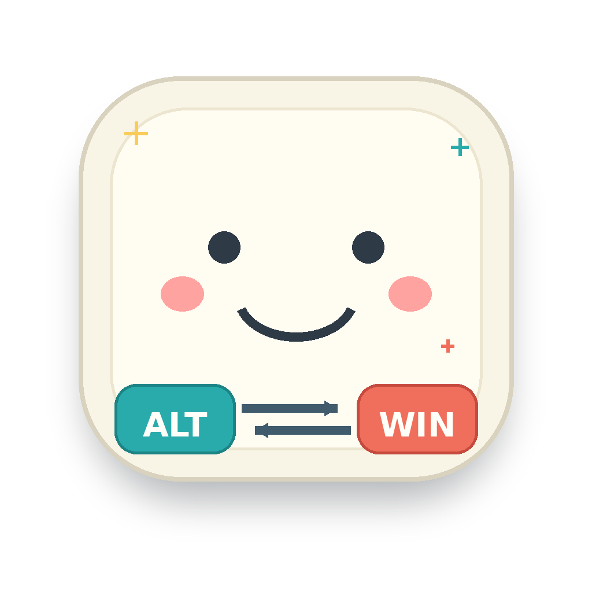

# MacAltWinSwap

Win11 用户态小工具，用来把 `Win` 和 `Alt` 全局互换，适合外接 Mac 键盘：

- `Left Win` <-> `Left Alt`
- `Right Win` <-> `Right Alt`

程序运行后驻留在系统托盘，右键托盘图标可以启用/禁用、设置开机启动或退出。



## 构建

在 Windows 11 上安装 Visual Studio 2022 或 Build Tools，然后打开 Developer PowerShell：

```powershell
cmake -S . -B build -G "Visual Studio 17 2022" -A x64
cmake --build build --config Release
```

生成文件在：

```text
build\Release\MacAltWinSwap.exe
```

也可以在 WSL 里用 MinGW 交叉编译：

```bash
sudo apt-get install -y cmake mingw-w64
cmake -S . -B build-mingw \
  -DCMAKE_SYSTEM_NAME=Windows \
  -DCMAKE_CXX_COMPILER=x86_64-w64-mingw32-g++ \
  -DCMAKE_RC_COMPILER=x86_64-w64-mingw32-windres \
  -DCMAKE_BUILD_TYPE=Release
cmake --build build-mingw --config Release
```

生成文件在：

```text
build-mingw/MacAltWinSwap.exe
```

## 使用

直接运行：

```powershell
.\build\Release\MacAltWinSwap.exe
```

右键托盘图标：

- `Enabled`：临时启用/禁用交换
- `Start with Windows`：写入/移除当前用户的开机启动项
- `Exit`：退出程序

## 说明和限制

这个工具使用 `WH_KEYBOARD_LL` 低级键盘钩子和 `SendInput`，不安装驱动，不改注册表键盘布局扫描码映射。

纯用户态低级键盘钩子拿不到可靠的物理键盘设备 ID，所以这里做的是全局交换，不能只针对某一把外接键盘生效。如果必须只对外接 Mac 键盘生效，通常需要驱动层方案，或使用系统/厂商提供的按设备重映射能力。

未提权运行时，Windows 的完整性级别限制可能导致它无法影响管理员权限窗口；如果需要在管理员窗口中也生效，请以管理员身份运行本程序。

## 版权和授权

Copyright (c) 2026 Tian.

代码和项目内生成的图标资产使用 MIT License，详见 [LICENSE](LICENSE)。

图标由仓库内的 `scripts/generate_assets.py` 本地生成，没有包含第三方图片素材，也没有使用 Apple 或 Microsoft 的商标图形。
